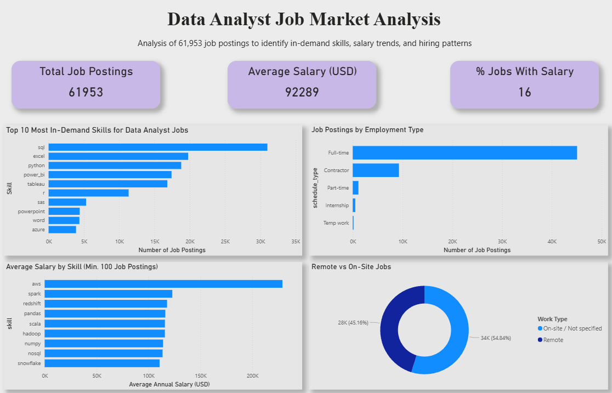

# Data Analyst Job Market Analysis

## Overview
Analysis of 61,953 real data analyst job postings scraped from Google Jobs (USA) to identify the most in-demand skills, salary trends, and hiring patterns.

## Tools Used
- **PostgreSQL** — database storage and management
- **SQL** — data cleaning and analysis
- **Power BI** — dashboard and visualizations

## Dataset
- Source: [Luke Barousse - Data Analyst Jobs (Kaggle)](https://www.kaggle.com/datasets/lukebarousse/data-analyst-job-postings-google-search)
- 61,953 job postings from the United States
- Fields include: job title, company, location, salary, skills, schedule type

## Key Findings
1. **SQL is the #1 most in-demand skill** — appears in over 31,000 job postings (50% of all jobs)
2. **Cloud and big data skills pay significantly more** — Spark, Redshift, and AWS roles average $115,000-$123,000 vs the $92,289 overall average
3. **45% of data analyst roles are remote** — with virtually identical pay to on-site roles ($92,447 vs $92,027)
4. **Only 16% of job postings include salary data** — making salary benchmarking difficult for job seekers
5. **Full-time roles dominate at 73%** of all postings with an average salary of $99,876

## SQL Queries
See `analysis_queries.sql` for all queries used in this project.

## Dashboard

